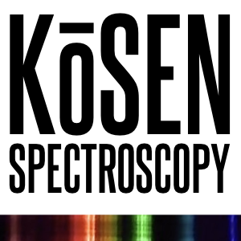

# KOSEN USB Spectroscopy

A Python desktop application that turns a USB webcam + diffraction grating into a
visible-light spectrometer. Real-time spectrum acquisition, live camera preview
with an interactive ROI, and pixel→wavelength calibration.



## Features

- **Live USB camera feed** with an interactive Region Of Interest (ROI)
  - Click on the preview to place the ROI; a crosshair reports the pixel under the cursor
  - Horizontal / vertical optical flip (flips the spectrum, ROI stays consistent)
- **Real-time spectrum plot**
  - Auto-fits to the ROI in real time; the plot is read-only (a cursor reads λ / pixel)
  - X axis switches to nanometers once calibrated
- **Wavelength calibration**
  - **Auto CFL**: detects the peaks of a compact-fluorescent lamp and assigns the
    436 nm (blue) and 546 nm (green) mercury lines
  - **Manual**: assign two pixel→nm reference points
- **Signal processing**: IIR average filter + Savitzky-Golay spatial smoothing
- **Saving**
  - Spectrum data as CSV / TXT
  - Quick PNG screenshot of the plot
  - A measurement name becomes the plot title and the file-name prefix
    (spaces → underscores), with a `YYYYMMDD_HHMMSS` timestamp appended.
    Without a name, files are saved as `spectrum_<timestamp>`.

## Requirements

- Python 3.10+
- A USB webcam
- Dependencies (see `requirements.txt`): PyQt6, pyqtgraph, opencv-python,
  numpy, scipy, pillow, matplotlib

## Quick start

### Linux

```bash
./run.sh
```

Creates the virtual environment on first run, installs everything, and launches
the app. If Qt complains about the `xcb` platform plugin, install the system
libraries listed at the top of `run.sh`.

### macOS

```bash
./setup.sh                       # one-time: create venv + install deps
source venv/bin/activate
python3 kosen_spectroscopy.py
```

### Windows

```bat
python -m venv venv
venv\Scripts\activate
pip install -r requirements.txt
python kosen_spectroscopy.py
```

## Usage

1. Pick your **USB Camera** and click **Connect WebCam**.
2. Point the grating at a light source; adjust the **ROI** (X Start / X End /
   Y Pos / Y Height) — larger Y Height averages more rows for a smoother, brighter
   spectrum.
3. Calibrate:
   - Illuminate with a **CFL lamp** and click **Auto CFL**, or
   - Read two peak pixels off the plot and enter them under **Manual**.
4. Name the measurement, then **Save** the data or take a **Screenshot**.

## License

MIT — see `LICENSE`.
